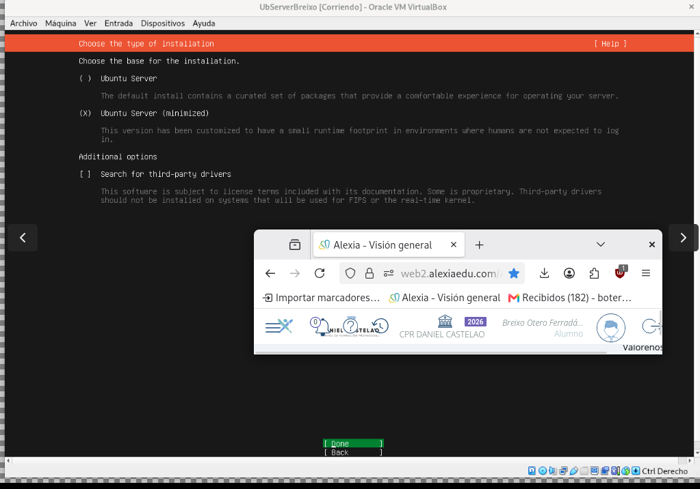
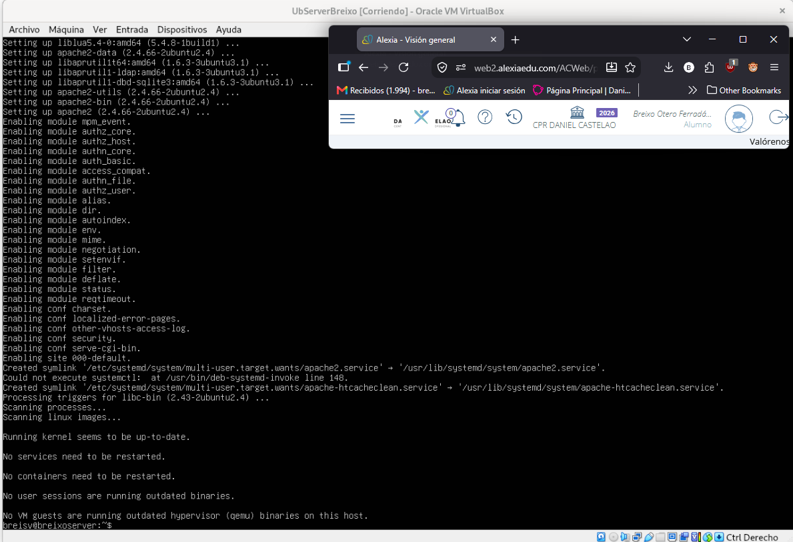
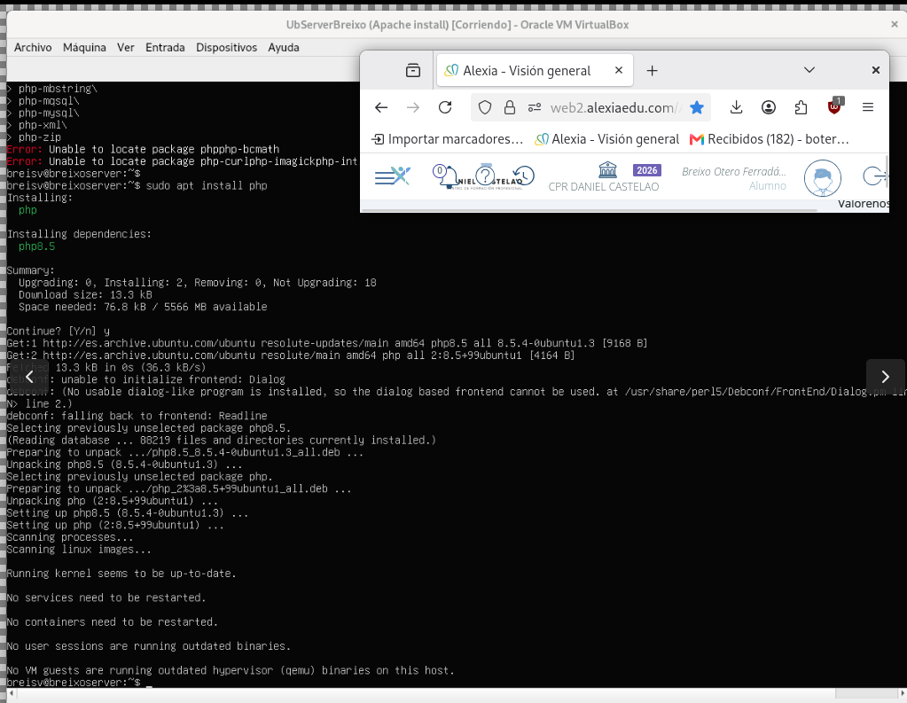
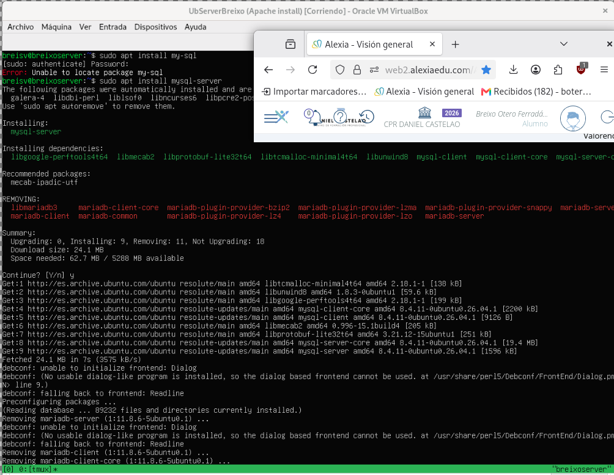
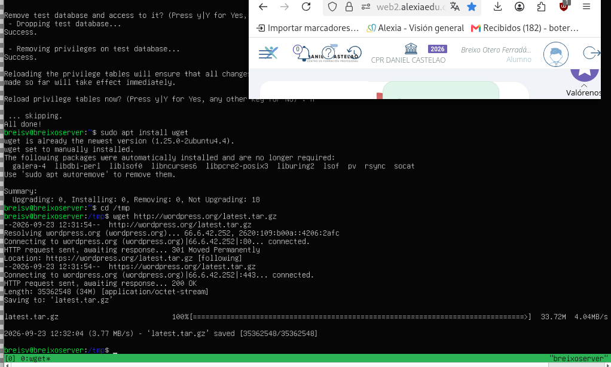
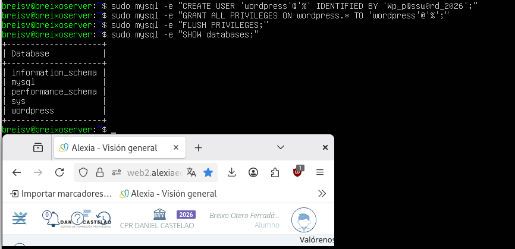

# SXE_Tarea01

<h2>Tabla de especificaciones/analisis</h2>

|   Elemento  | Lo que dice la documentación | Lo que necesita la VM | Otros (comentarios relevantes) | Fuente de info | 
| ------------- | ------------- | ------------- | ------------- | ------------- |
| **S.O** | No específica ningún S.O  | Ubuntu Server 24.04 LTS | No se especifica ningún S.O, pero he considerado instalar Ubuntu Server porque es una distro ligera y está preparada para este tipo de tarea | https://ubuntu.com/tutorials/install-and-configure-wordpress#1-overview |
| **Servidor Web**  | Apache, Nginx | Apache2 | Se opta por Apache por su amplia compatibilidad y facilidad de configuración con WordPress | https://wordpress.org/about/requirements/ |
| **Version PHP** | PHP 7.4+  | PHP 8.2 | La documentación dice 7.4 o mas, pero instalaré una superior y actual | https://wordpress.org/about/requirements/ \|\| https://nexonhost.com/wordpress-hosting-requirements |
| **Gestor de BBDD** | MySQL 5.5.5+  | MySQL 8.0 | Al igual que con PHP, la versión 5.5.5 es la mínima, pero se opta por instalar MySQL 8.0 para contar con un entorno actualizado y estable.  | https://nexonhost.com/wordpress-hosting-requirements |
| **Memoria y Disco** | 1.5 GB de RAM 5GB de espacio en disco | 3GB de RAM como mínimo 25GB de espacio en disco | Se asignan recursos por encima del mínimo requerido para garantizar un buen rendimiento de la VM. | https://ubuntu.com/server/docs/reference/installation/system-requirements/ |

<h2>Configuacion de la VM</h2>
<ul>
  <li> <strong>S.O</strong>:   Ubuntu Server 26.04.1</li>
  <li><strong>Nº de Cores:</strong> 2</li>
  <li><strong>Memoria Total:</strong> 4GB</li>
  <li><strong>Espacio en Disco:</strong> 25GB</li>
</ul>
<br>

<h2>Instalación</h2>

<h3>1. S.O. - Instalacion de Ubuntu Server</h3>


<p>Avanzar con las opciones por defecto e instalar el SSH para poder operar con comandos el sistema</p>

<h3>2. Servidor Web - Instalacion de Apache</h3>


Comando: 
```
sudo systemctl start apache2
sudo systemctl enable apache2
```

<h3>3 - Instalacion de PHP</h3>


Comando: 
```
sudo apt install php
```

<h3>4 - Instalacion de MySQL</h3>


Comando: 
```
sudo apt install mysql-server
```

<h3>5 - Instalacion de Wordpress</h3>


Descargar el archivo necesario:
```
sudo apt install wget
cd /tmp
wget http://wordpress.org/latest.tar.gz
```
Desempaquetarlo:
```
tar -xf latest.tar.gz
```
Moverlo al directorio por defecto de los archivos web de Apache2:
```
sudo mv wordpress /var/www/html
sudo chown www-data:www-data /var/www/html -R
```

<h3>6 - Configuracion de Wordpress </h3>



Creacion de base de datos en wordpress, usuario y contraseña mas comprobacion de que ha sido creada

Para crear la base de datos:
```
sudo mysql -e "CREATE DATABASE wordpress;"
```
Crear Usuario y Contraseña:
```
sudo mysql -e "CREATE USER 'wordpress'@'%' IDENTIFIED BY ´contraseña_exemplo´;"
```
Dar permisos: 
```
sudo mysql -e "GRANT ALL PRIVILEGES ON wordpress.* TO 'wordpress'@'%';"
```
Comprobar a creacion: 
```
sudo mysql -e "SHOW databases;"
```
